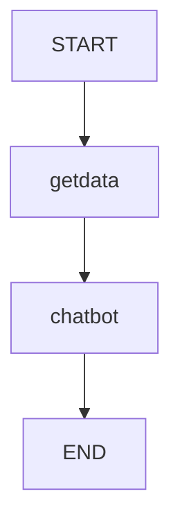

# Inquiry_Agent
# 🤖 Inquiry_Agent
> *AI-Powered inquiry agent that is able to fetch data using a tool from an public API and then response the user in natural language.*

---

## 🧠 Overview
This agaent uses LangGraph and LangChain to build intelligent workflows for data recieved from API. It acts as an AI assistant that converts JSON format of data recieved from an API  and summarizes results into human-readable insights using Gemini 2.5 Flash.

---

## ⚙️ Tech Stack
- **LangGraph** – workflow orchestration  
- **LangChain** – LLM-powered query building  
- **Gemini 2.5 Flash** – summarization model  
- **Python 3.10+**, **Requests**, **dotenv**, **IPython.display**

---

## 🏗️ Architecture

1. **getdata()** — fetches data from an API or DB.  
2. **chatbot()** — summarizes data via Gemini.  
3. **StateGraph** — manages state transitions.  
4. **Output** — prints responses and visualizes flow.

---

## 🚀 Usage
```bash
git clone https://github.com/yourusername/CineMind.git
cd Inquiry_Agent
pip install -r requirements.txt
python app.py
```

Add a `.env` file:
```env
GOOGLE_API_KEY=your_google_api_key
```

---

## 💡 Example Output
```
Chatbot_response: The user with ID 1 is Leanne Graham from Gwenborough.
```
A workflow graph (`my_graph.png`) is generated automatically.

---

## 🧩 Future Scope
- Integrate real **API data**  
- Add **intent classification** and **query generation**  
- Build **frontend (React/Streamlit)**  
- Deploy via **FastAPI**


